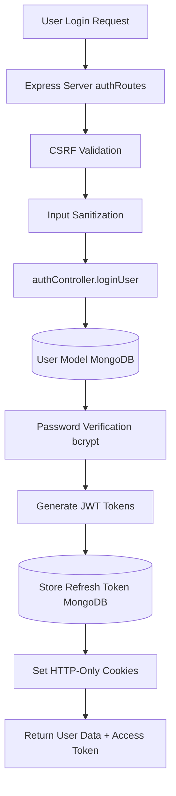
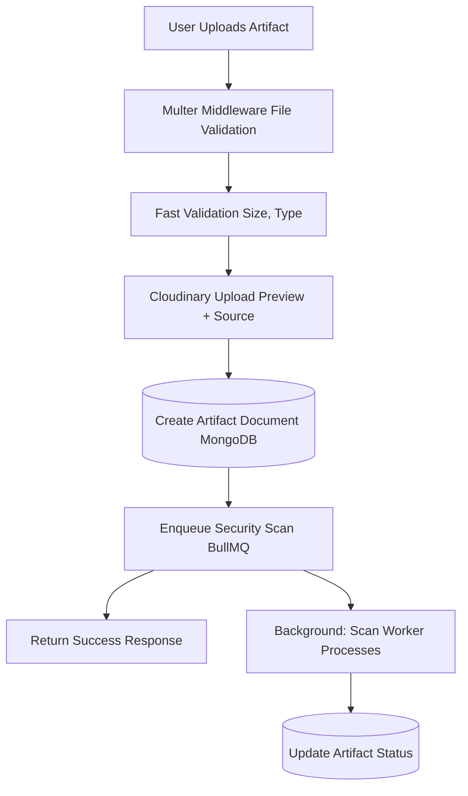
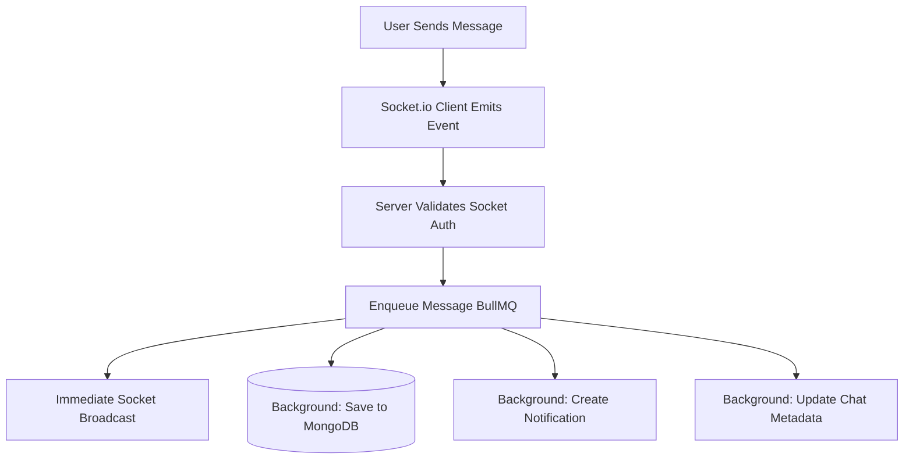
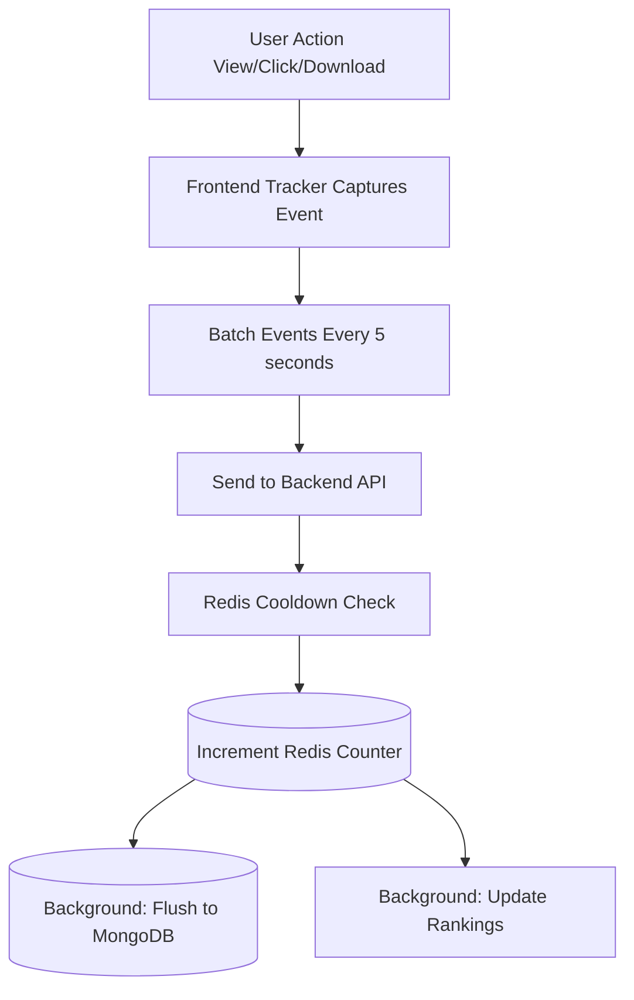
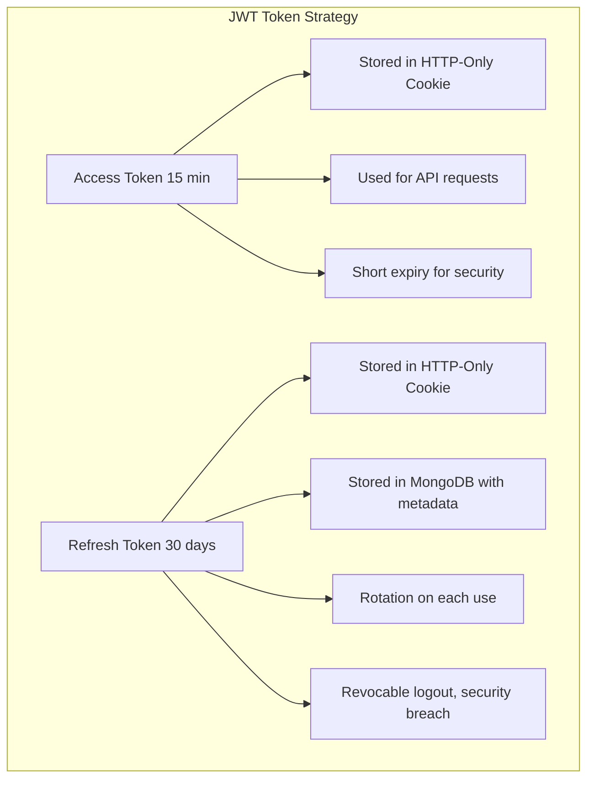
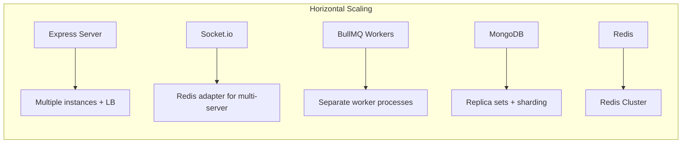

# System Architecture Documentation

## 🏛️ High-Level Architecture

```mermaid
graph TD
    subgraph Client Layer
        NextJS[Next.js Frontend]
        SocketIO[Socket.io Client]
        WebRTC[WebRTC Signaling]
    end

    subgraph API Gateway Layer
        Express[Express.js Server Port 5000<br/>- CORS Configuration<br/>- CSRF Protection<br/>- Rate Limiting<br/>- Request Sanitization]
    end

    subgraph Middleware Layer
        AuthMW[Auth Middleware]
        ValMW[Validation Middleware]
        SecMW[Security Middleware]
    end

    subgraph Business Logic Layer
        Controllers[Optimized Controllers<br/>- artifactController<br/>- authController<br/>- chatController<br/>- challengeController<br/>- contractController<br/>- analyticsController<br/>- Custom matching logic]
    end

    subgraph Service Layer
        CloudinaryService[Cloudinary Service]
        EmailService[Email Service]
        GamificationService[Gamification Service]
        ContractService[Contract Service]
        RecommendationService[Recommendation Service]
    end

    subgraph Data Access Layer
        Mongoose[Complex Data Models<br/>- User, Artifact, Post, Comment<br/>- Challenge, Contract, Job, Proposal<br/>- Chat, Message, Notification<br/>- Analytics Models]
    end

    subgraph Persistence Layer
        MongoDB[(MongoDB Database)]
        Redis[(Redis Cache)]
        Cloudinary[(Cloudinary Storage)]
    end

    subgraph Background Processing
        BullMQ[BullMQ Workers<br/>- Security Scan Worker<br/>- Notification Worker<br/>- Ranking Worker<br/>- Image Processing Worker<br/>- Email Worker]
    end

    Client Layer --> API Gateway Layer
    API Gateway Layer --> Middleware Layer
    Middleware Layer --> Business Logic Layer
    Business Logic Layer --> Service Layer
    Business Logic Layer --> Data Access Layer
    Service Layer --> Persistence Layer
    Data Access Layer --> Persistence Layer
    Business Logic Layer --> Background Processing
```

## 🔄 Data Flow Architecture

### 1. User Authentication Flow



### 2. Artifact Upload Flow



### 3. Real-time Chat Flow



### 4. Analytics Tracking Flow



## 🗄️ Database Schema Design

### Core Collections

#### 1. Users Collection
```javascript
{
  _id: ObjectId,
  name: String,
  username: String (unique, indexed),
  email: String (unique, indexed),
  password: String (hashed),
  role: Enum ['user', 'patron', 'admin', 'superadmin'],
  
  // Profile
  profilePicture: String,
  bio: String,
  skills: [String],
  
  // Craftsman
  hasCraftsmanAccount: Boolean,
  craftsmanProfileId: ObjectId (ref: CraftsmanProfile),
  
  // Gamification
  gamification: {
    xp: Number,
    level: Number,
    badges: [Object],
    streak: Object
  },
  
  // Verification
  isVerified: Boolean,
  verificationLevel: Enum,
  
  // Security
  twoFactorEnabled: Boolean,
  loginAttempts: Number,
  lockUntil: Date,
  
  // Analytics
  device: String,
  browser: String,
  location: Object,
  
  // Wallet
  walletBalance: Number,
  totalEarnings: Number,
  
  timestamps: true
}
```

#### 2. Artifacts Collection
```javascript
{
  _id: ObjectId,
  user: ObjectId (ref: User, indexed),
  title: String (indexed),
  slug: String (unique, indexed),
  description: String,
  
  // Content
  previewFile: String (Cloudinary URL),
  devlogFile: String (Cloudinary URL),
  
  // Categorization
  category: Enum,
  tags: [String] (indexed),
  tech: [String],
  
  // Pricing
  priceType: Enum ['free', 'paid'],
  price: Number,
  discount: Number,
  purchasedBy: [ObjectId] (indexed),
  
  // Analytics
  viewsCount: Number,
  downloadsCount: Number,
  impressionsCount: Number,
  likeCount: Number,
  likedBy: [String],
  
  // Security
  scanResult: {
    scanned: Boolean,
    passed: Boolean,
    errors: [String],
    scannedAt: Date
  },
  
  // Versioning
  versions: [Object],
  currentVersion: String,
  
  // Flags
  status: Enum ['pending', 'approved', 'rejected'],
  trending: Boolean,
  popular: Boolean,
  
  timestamps: true
}
```

#### 3. Contracts Collection
```javascript
{
  _id: ObjectId,
  client: ObjectId (ref: User),
  craftsman: ObjectId (ref: User),
  job: ObjectId (ref: Job),
  
  // Contract Details
  title: String,
  description: String,
  budget: Number,
  
  // Milestones
  milestones: [{
    title: String,
    amount: Number,
    status: Enum,
    dueDate: Date
  }],
  
  // Status
  status: Enum ['pending', 'active', 'completed', 'disputed'],
  
  // Escrow
  escrowAmount: Number,
  
  // Time Tracking
  totalHours: Number,
  
  timestamps: true
}
```

### Analytics Collections

#### 4. Interactions Collection
```javascript
{
  _id: ObjectId,
  userId: ObjectId (ref: User),
  targetId: ObjectId,
  targetType: String,
  actionType: Enum ['view', 'like', 'download', 'share'],
  metadata: Object,
  timestamp: Date (indexed)
}
```

#### 5. SessionReplay Collection
```javascript
{
  _id: ObjectId,
  userId: ObjectId (ref: User),
  sessionId: String (indexed),
  events: [Object],
  duration: Number,
  pageViews: [Object],
  timestamp: Date
}
```

## 🔐 Security Architecture

### Authentication Flow



### CSRF Protection

```
Double-Submit Cookie Pattern:
1. Server generates CSRF token
2. Token stored in cookie (readable by JS)
3. Frontend reads token from cookie
4. Frontend sends token in X-XSRF-TOKEN header
5. Server validates cookie token === header token
```

### Rate Limiting Strategy

```javascript
// Global rate limit
- 100 requests per 15 minutes per IP

// Auth endpoints
- 5 login attempts per 15 minutes per IP
- Account lockout after 5 failed attempts

// Upload endpoints
- 10 uploads per hour per user

// API endpoints
- 1000 requests per hour per user
```

## 🚀 Performance Optimization Strategies

### 1. Database Optimization

#### Indexing Strategy
```javascript
// User Model
- email: unique index
- username: unique index
- name + username + email: text index

// Artifact Model
- user: index
- slug: unique index
- title + tags + tech: text index
- status + priceType: compound index
// Interaction Model
- userId + targetId + actionType: compound index
- timestamp: index (for time-based queries)
```

#### Query Optimization
```javascript
// Use lean() for read-only queries
const artifacts = await Artifact.find().lean();

// Select only needed fields
const users = await User.find().select('name email profilePicture');

// Batch operations
const userIds = artifacts.map(a => a.user);
const users = await User.find({ _id: { $in: userIds } });

// Pagination
const skip = (page - 1) * limit;
const results = await Model.find().skip(skip).limit(limit);
```

### 2. Redis Caching Strategy

```javascript
// Cache Structure
┌─────────────────────────────────────────────────────────┐
│  Cache Key Pattern                                       │
├─────────────────────────────────────────────────────────┤
│  artifacts:trending:zset     → Sorted set (trending)    │
│  artifacts:popular:zset      → Sorted set (popular)     │
│  views:cooldown:{id}:{user}  → String (60s TTL)         │
│  views:count:{id}            → String (300s TTL)        │
│  impressions:delta:{id}      → Counter                  │
└─────────────────────────────────────────────────────────┘

// Cache Invalidation
- TTL-based expiration
- Manual invalidation on updates
- Cache warming for trending content
```

### 3. Queue-based Processing

```javascript
// Queue Types
┌─────────────────────────────────────────────────────────┐
│  Queue Name          │  Purpose                         │
├─────────────────────────────────────────────────────────┤
│  scan-queue          │  Security scanning               │
│  ranking-queue       │  Ranking calculations            │
│  notification-queue  │  Notification delivery           │
│  email-queue         │  Email sending                   │
│  image-queue         │  Image processing                │
│  chat-queue          │  Chat message processing         │
└─────────────────────────────────────────────────────────┘

// Benefits
- Non-blocking operations
- Retry mechanisms
- Job prioritization
- Scalable processing
```

## 🔄 Real-time Architecture

### Socket.io Implementation

```javascript
// Connection Flow
Client connects → Server authenticates → Join rooms → Listen for events

// Event Types
┌─────────────────────────────────────────────────────────┐
│  Event Category      │  Events                          │
├─────────────────────────────────────────────────────────┤
│  User Status         │  user:online, user:offline       │
│  Chat                │  message:new, message:unsend     │
│  Typing              │  typing:start, typing:stop       │
│  Notifications       │  notification:new                │
│  WebRTC              │  call:initiate, call:accept      │
└─────────────────────────────────────────────────────────┘

// Room Management
- User-specific rooms: user:{userId}
- Chat rooms: chat:{chatId}
- Discussion rooms: discussion:{discussionId}
```

## 📊 Analytics Architecture

### Tracking System

```javascript
// Frontend Trackers
┌─────────────────────────────────────────────────────────┐
│  Tracker Type        │  Data Collected                  │
├─────────────────────────────────────────────────────────┤
│  MouseTracker        │  Movements, clicks, scrolls      │
│  KeystrokeTracker    │  Typing patterns, speed          │
│  SessionRecorder     │  Full session replay             │
│  NetworkTracker      │  API latency, errors             │
│  DeviceTracker       │  Device info, screen size        │
│  FormTracker         │  Form interactions, abandonment  │
│  VideoTracker        │  Video engagement metrics        │
└─────────────────────────────────────────────────────────┘

// Data Pipeline
Frontend → Batch (5s) → API → Redis → Background Worker → MongoDB
```

## 🎯 Scalability Considerations

### Horizontal Scaling



### Vertical Scaling

```
- Optimize queries (indexes, lean())
- Implement caching (Redis)
- Use CDN for static assets (Cloudinary)
- Compress responses (gzip)
- Minimize payload size
```

## 🛠️ Development Workflow

### Code Organization

```
Feature-based Structure:
- Each feature has its own controller, model, routes
- Shared utilities in utils/
- Reusable middleware in middlewares/
- Services for external integrations
```

### Error Handling

```javascript
// Centralized Error Middleware
app.use((err, req, res, next) => {
  logger.error(err);
  res.status(err.statusCode || 500).json({
    success: false,
    message: err.message,
    stack: NODE_ENV === 'development' ? err.stack : undefined
  });
});
```

### Logging Strategy

```javascript
// Winston Logger
- Info: General information
- Warn: Potential issues
- Error: Errors with stack traces
- Debug: Detailed debugging info

// Log Rotation
- Daily rotation
- Max file size: 20MB
- Keep last 14 days
```

---

**This architecture is designed for:**
- High availability
- Horizontal scalability
- Security-first approach
- Performance optimization
- Maintainability
- Developer experience
